# Remediation Roadmap

Derived from [REVIEW.md](../REVIEW.md) (commit `935ca73`, 2026-08-21). Every finding in that review is
assigned to exactly one plan under [docs/plans/](plans/). Future feature ideas live separately in
[FUTURE_FEATURES.md](../FUTURE_FEATURES.md) and are deliberately **not** scheduled here.

**The headline constraint:** the review's verdict is *"not safe to run unattended with real money
until C-1 … C-5 are fixed."* Those five are Phase 1, items P1-01 … P1-04. Nothing in Phases 2–5 is
more urgent than any of them.

> **Currently executing:** [HANDOFF.md](HANDOFF.md) — Wave 0, the nine plans that need no
> prerequisites, including all five critical findings. Start there.

---

## 1. How to use this roadmap

- Each row in the tables below is **one branch, one PR**. The plan file is the spec.
- **Ready** means every prerequisite is merged. Pick any ready row; several agents can work at once.
- **Depends on** is a hard prerequisite — the work does not make sense (or will be rewritten) before
  it lands. **Soft** dependencies only affect diff size, not correctness; they are noted in the plan
  files.
- **Conflict surface** names files that other in-flight plans also touch. Two agents *can* work on
  overlapping files; expect a rebase. The suggested merge order in §4 minimises that.
- Branch from **`review-and-fix`** and PR back into it; `main` stays untouched until the maintainer
  merges the accumulated work. The working protocol is in [plans/README.md](plans/README.md), the
  base-branch details in [HANDOFF.md](HANDOFF.md) §3.
- **Every PR closes its own plan out**: the tables here, the status board and the REVIEW.md finding
  are updated on the plan's branch, so this roadmap is accurate the moment a PR merges. The list of
  what to touch is [Closing out a plan](plans/README.md#closing-out-a-plan). If a merge invalidates
  guidance written for another plan — a merge order, a conflict note — that gets fixed in the same
  commit.

---

## 2. Phase overview

| Phase | Goal | Plans | Rough effort | Gate to leave the phase |
|---|---|---|---|---|
| **1 — Stop the bleeding** | The bot cannot lose money through a known failure path; the test suite is safe; CI exists | P1-01 … P1-10 | ~1–1.5 days of work, parallelisable to ~half a day | C-1…C-5 closed, `dotnet test` safe, CI green on every PR |
| **2 — Contract & numeric correctness** | Failures are representable, money is exact, the DB schema is owned by the service that owns it | P2-01 … P2-09 | ~3–4 days | No sentinel returns, no ambient-culture parse, no `double` money |
| **3 — Make it testable** | Interfaces and a pure planner; the critical logic is unit-testable | P3-01 … P3-03 | ~2–3 days | Coverage bar agreed in P3-03, no live-network unit tests |
| **4 — Operational hardening** | Survives outages, restarts and shutdowns without data loss or duplicate buys | P4-01 … P4-10 | ~4–5 days | Healthy under fault injection; clean SIGTERM |
| **5 — Docs & hygiene** | The documentation describes reality; the repo is tidy | P5-01 … P5-05 | ~1 day | README/CHANGELOG accurate, warnings-as-errors clean |

---

## 3. Dependency graph

```mermaid
graph TD
  subgraph P1["Phase 1 — stop the bleeding"]
    P101["P1-01 · C-1<br/>gate live tests"]
    P102["P1-02 · C-2,C-3<br/>guard sentinels"]
    P103["P1-03 · C-4<br/>clamp + state order"]
    P104["P1-04 · C-5<br/>loop resilience"]
    P105["P1-05 · H-3<br/>ci.yml"]
    P106["P1-06 · H-4<br/>.dockerignore"]
    P107["P1-07 · H-10<br/>validators"]
    P108["P1-08 · H-11<br/>db credentials"]
    P109["P1-09 · M-16<br/>redact secrets"]
    P110["P1-10 · H-12<br/>deterministic tests"]
  end

  subgraph P2["Phase 2 — contracts & numerics"]
    P201["P2-01 · I-1<br/>KrakenResult&lt;T&gt;"]
    P202["P2-02 · H-1<br/>InvariantCulture"]
    P203["P2-03 · H-2<br/>decimal money"]
    P204["P2-04 · I-2<br/>entity split"]
    P205["P2-05 · I-3,M-3<br/>AssetPairs"]
    P206["P2-06 · H-9<br/>pagination"]
    P207["P2-07 · H-5<br/>watermark"]
    P208["P2-08 · I-5<br/>TradingOptions"]
    P209["P2-09 · M-18..20<br/>workflow hardening"]
  end

  subgraph P3["Phase 3 — testability"]
    P301["P3-01<br/>seams + TimeProvider"]
    P302["P3-02<br/>DcaPlanner"]
    P303["P3-03 · M-25<br/>coverage gaps"]
  end

  subgraph P4["Phase 4 — hardening"]
    P401["P4-01 · H-6,I-6<br/>JsonStateStore"]
    P402["P4-02 · H-7<br/>holiday cache"]
    P403["P4-03 · H-8,M-11<br/>HttpClient"]
    P404["P4-04 · M-24<br/>cancellation"]
    P405["P4-05 · I-4<br/>nonce"]
    P406["P4-06 · M-17,M-21<br/>healthchecks"]
    P407["P4-07 · M-22<br/>mail transport"]
    P408["P4-08<br/>reporting fixes"]
    P409["P4-09<br/>scheduling fixes"]
    P410["P4-10<br/>parsing/config"]
  end

  subgraph P5["Phase 5 — docs & hygiene"]
    P501["P5-01 · L-1,L-2,M-23<br/>README"]
    P502["P5-02 · L-3<br/>versioning"]
    P503["P5-03 · L-4<br/>CONTRIBUTING"]
    P504["P5-04 · L-5..L-16<br/>hygiene"]
    P505["P5-05 · L-11<br/>renames"]
  end

  P101 --> P105
  P101 --> P303
  P101 --> P503
  P103 --> P110
  P103 --> P208
  P107 --> P208
  P102 --> P201
  P104 --> P201
  P104 --> P207
  P105 --> P209
  P105 --> P504
  P105 --> P503
  P108 --> P406
  P201 --> P205
  P201 --> P206
  P201 --> P301
  P202 --> P203
  P203 --> P204
  P203 --> P205
  P203 --> P408
  P204 --> P408
  P206 --> P207
  P209 --> P502
  P301 --> P302
  P301 --> P303
  P302 --> P409
  P403 --> P404
```

*(Soft dependencies are omitted from the graph to keep it readable — see the per-plan tables.)*

---

## 4. Wave plan — what an agent can pick up, and when

### Wave 0 — ready now, fully parallel (no prerequisites)

Nine plans, zero hard dependencies between them (P2-02 is a Phase-2 plan that happens to need
nothing — take it if Phase-1 capacity is saturated). Three of them touch `DcaWorker.cs`, so their
merge order matters (see the note below) but their *development* does not.

| Plan | Branch | Findings |
|---|---|---|
| ~~P1-01~~ ✅ merged | `test/p1-c1-gate-live-trading-tests` | C-1 |
| ~~P1-02~~ ✅ merged | `fix/p1-c2-c3-guard-worker-sentinels` | C-2, C-3 |
| ~~P1-03~~ ✅ merged | `fix/p1-c4-topup-day-clamp-and-state-order` | C-4 |
| P1-04 | `fix/p1-c5-worker-loop-resilience` | C-5 |
| P1-06 | `fix/p1-h4-dockerignore-and-secret-copy` | H-4 |
| P1-07 | `fix/p1-h10-tighten-options-validators` | H-10 |
| P1-08 | `fix/p1-h11-database-credentials-exposure` | H-11 |
| P1-09 | `fix/p1-m16-redact-secrets-in-logs` | M-16 |
| P2-02 | `fix/p2-h1-invariant-culture` | H-1 |

> **`DcaWorker.cs` merge order: P1-02 → P1-03 → P1-04.** P1-02 and P1-03 are merged, so P1-04 builds
> on both. Each is a small, local edit; rebasing is a two-minute job.
>
> **`TimeComputeService.cs`** is touched by P1-02 (divisor guard, merged) and P1-03 (date clamp,
> merged) — nothing in Wave 0 is still waiting on that file.

### Wave 1 — unlocked by Wave 0

| Plan | Unlocked by | Branch |
|---|---|---|
| P1-05 | P1-01 | `ci/p1-h3-build-test-lint-pipeline` |
| P1-10 | ✅ P1-03 *(merged — ready)* | `test/p1-h12-deterministic-timecompute-tests` |
| P2-01 | ✅ P1-02 + P1-04 (waiting on P1-04) | `refactor/p2-i1-kraken-result-protocol` |
| P2-03 | P2-02 | `refactor/p2-h2-decimal-money` |
| P2-08 | ✅ P1-03 + P1-07 (waiting on P1-07) | `refactor/p2-i5-shared-trading-options` |
| P2-09 | P1-05 | `ci/p2-workflow-hardening` |
| P4-01 | — (soft: P3-01) | `refactor/p4-h6-json-state-store` |
| P4-02 | — (soft: P3-01) | `fix/p4-h7-holiday-cache-resilience` |
| P4-03 | — (soft: P3-01) | `refactor/p4-h8-httpclient-lifetimes-resilience` |
| P4-05 | — | `fix/p4-i4-nonce-monotonicity` |
| P4-06 | P1-08 | `fix/p4-m17-m21-startup-and-healthchecks` |
| P4-07 | — (soft: P3-01) | `refactor/p4-m22-mail-transport-mailkit` |
| P4-10 | — (soft: P2-02, P2-03) | `fix/p4-parsing-and-config-robustness` |
| P5-01 | — (best after P1-08, P2-08, P4-09) | `docs/p5-readme-accuracy` |

> **Phase 4 is unusually independent.** P4-01/02/03/05/06/07 need nothing from Phase 2 or 3 — they are
> only *smaller* after P3-01. If you have spare parallel capacity while Phase 2 is in flight, this is
> where to spend it. The trade-off is stated per plan.

### Wave 2 — unlocked by Wave 1

| Plan | Unlocked by | Branch |
|---|---|---|
| P2-04 | P2-03 | `refactor/p2-i2-split-domain-and-persistence` |
| P2-05 | P2-01 + P2-03 | `feat/p2-i3-asset-pair-metadata` |
| P2-06 | P2-01 | `fix/p2-h9-pagination-integrity` |
| P3-01 | P2-01 + P2-03 | `refactor/p3-testability-seams` |
| P4-04 | P4-03 | `refactor/p4-m24-cancellation-propagation` |
| P5-02 | P2-09 | `docs/p5-version-reconciliation` |
| P5-03 | P1-01 + P1-05 | `docs/p5-contributing-and-security` |
| P5-04 | P1-05 | `chore/p5-hygiene-dead-code-and-config` |
| P3-03 (pure half) | P1-01 | `test/p3-coverage-gaps-pure` |

### Wave 3

| Plan | Unlocked by | Branch |
|---|---|---|
| P2-07 | P2-06 + P1-04 | `fix/p2-h5-monthly-report-watermark` |
| P3-02 | P3-01 | `refactor/p3-dca-planner` |
| P4-08 | P2-03 + P2-04 | `fix/p4-reporting-correctness` |
| P3-03 (behaviour half) | P3-01, P3-02 | `test/p3-coverage-gaps-behaviour` |

### Wave 4

| Plan | Unlocked by | Branch |
|---|---|---|
| P4-09 | P3-02 | `fix/p4-dca-scheduling-correctness` |
| P5-05 | everything you intend to merge | `chore/p5-naming-consistency` — **merge last** |

---

## 5. Finding → plan coverage

Every finding in REVIEW.md, with its owning plan. Use this to check nothing was dropped.

| Finding | Plan | Finding | Plan |
|---|---|---|---|
| C-1 ✅ | P1-01 *(merged)* | M-1 | P4-08 |
| C-2 ✅ | P1-02 *(merged)* (→ P2-01) | M-2 | P4-09 |
| C-3 ✅ | P1-02 *(merged)* (→ P2-01) | M-3 | P2-05 |
| C-4 ✅ | P1-03 *(merged)* | M-4 | P4-09 |
| C-5 | P1-04 | M-5 | P4-09 |
| H-1 | P2-02 | M-6 | P4-09 |
| H-2 | P2-03 | M-7 | P4-08 |
| H-3 | P1-05 | M-8 | P4-08 |
| H-4 | P1-06 | M-9 | P4-10 |
| H-5 | P2-07 | M-10 | P4-05 (also noted in P4-10) |
| H-6 | P4-01 | M-11 | P4-03 |
| H-7 | P4-02 | M-12 | P4-08 |
| H-8 | P4-03 | M-13 | P4-08 |
| H-9 | P2-06 | M-14 | P4-10 |
| H-10 | P1-07 | M-15 | P4-10 |
| H-11 | P1-08 | M-16 | P1-09 |
| H-12 | P1-10 | M-17 | P4-06 |
| I-1 | P2-01 | M-18 | P2-09 |
| I-2 | P2-04 | M-19 | P2-09 |
| I-3 | P2-05 | M-20 | P2-09 |
| I-4 | P4-05 | M-21 | P4-06 |
| I-5 | P2-08 | M-22 | P4-07 |
| I-6 | P4-01 | M-23 | P5-01 |
| — | — | M-24 | P4-04 |
| L-1 | P5-01 | M-25 | P3-03 |
| L-2 | P5-01 | L-9 | P5-04 |
| L-3 | P5-02 | L-10 | P4-07 |
| L-4 | P5-03 | L-11 | P5-05 |
| L-5 | P5-04 | L-12 | P4-08 |
| L-6 | P5-04 | L-13 | P4-01 |
| L-7 | P5-04 | L-14 | P4-10 |
| L-8 | P5-04 | L-15 | P4-10 |
| | | L-16 | P5-04 |
| F-1, F-2, F-3 | [FUTURE_FEATURES.md](../FUTURE_FEATURES.md) — not scheduled | | |

---

## 6. Cross-cutting conflict map

Files that more than one plan edits. If two of these are in flight simultaneously, agree a merge
order up front.

| File | Plans | Suggested order |
|---|---|---|
| `src/Kbot.DcaService/DcaWorker.cs` | P1-02, P1-03, P1-04, P2-01, P2-05, P3-02, P4-09 | P1-02 → P1-03 → P1-04 → P2-01 → P2-05 → P3-02 → P4-09 |
| `src/Kbot.Common/Api/KrakenClient.cs` | P1-02, P2-01, P2-02, P2-03, P2-05, P2-06, P4-03, P4-04 | P1-02 → P2-02 → P2-01 → P2-03 → P2-06 → P2-05 → P4-03 → P4-04 |
| `src/Kbot.Common/Api/KrakenApi.cs` | P1-09, P4-03, P4-04, P4-05, P4-10 | P1-09 → P4-05 → P4-03 → P4-04 → P4-10 |
| `src/Kbot.DcaService/Utility/TimeComputeService.cs` | P1-02, P1-03, P1-10, P3-01, P3-02 | P1-02 ✅ → P1-03 ✅ → P1-10 → P3-01 → P3-02 (both merged; P1-10 is next) |
| `src/Kbot.MailService/Utility/MailSenderService.cs` | P2-05, P2-07, P4-07, P4-08 | P2-07 → P2-05 → P4-08 → P4-07 |
| `src/Kbot.MailService/Utility/OrderService.cs` | P2-01, P2-04, P2-06, P4-08 | P2-01 → P2-06 → P2-04 → P4-08 |
| `src/Kbot.MailService/Migrations/**` | P2-03, P2-04 | P2-03 → P2-04 (**never in parallel** — two pending migrations conflict) |
| `.github/workflows/**` | P1-05, P2-09, P5-02 | P1-05 → P2-09 → P5-02 |
| `docker/example-compose.yaml` | P1-08, P4-06, P5-02 | P1-08 → P4-06 → P5-02 |
| `docker/stack.env` | P1-08, P2-08, P4-10 | P1-08 → P2-08 → P4-10 |
| `README.md` | P4-05, P5-01, P5-02, P5-03 | P5-01 → P5-02 → P5-03 (P4-05 adds one section; merge whenever) |
| Both `ServiceCollectionExtension.cs` | P1-07, P2-08, P3-01, P4-03, P5-04 | P1-07 → P2-08 → P3-01 → P4-03 → P5-04 |

---

## 7. Milestones

| Milestone | Condition | What it buys |
|---|---|---|
| **M1 · Safe to run** | P1-01 … P1-04 merged | No known path loses money unattended; `dotnet test` is safe. This is the one milestone that matters. |
| **M2 · Guarded pipeline** | + P1-05 … P1-10, P2-09 | Nothing ships unbuilt or untested; no committed credential; validators reject degenerate config. |
| **M3 · Correct numbers** | + P2-01 … P2-08 | Failures are representable, money is exact, reports cannot silently skip data. |
| **M4 · Testable** | + P3-01 … P3-03 | The scheduling core is a pure function with real coverage; the live-exchange test is gone rather than merely gated. |
| **M5 · Operable** | + P4-01 … P4-10 | Survives API outages, DB outages, restarts and SIGTERM without duplicate buys or data loss. |
| **M6 · Documented** | + P5-01 … P5-05 | The README describes what the code does; a contributor can onboard without reading the review. |

After M5, [FUTURE_FEATURES.md](../FUTURE_FEATURES.md) **F-1 (self-monitoring)** is the natural next
step — the review recommends it first among the features because the bot's core failure mode is
silence, and F-1 is what makes every fix above verifiable in production.
